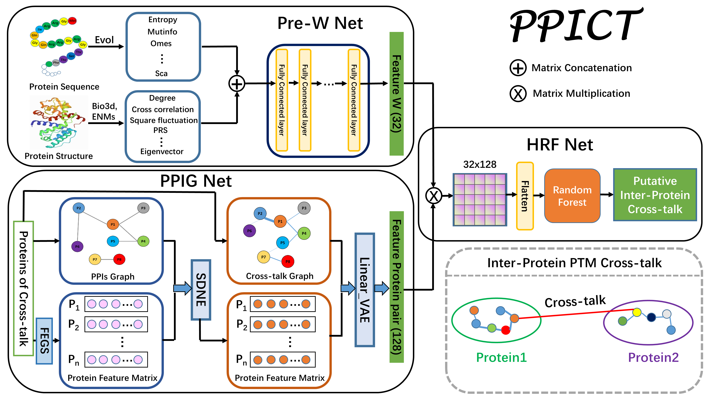

# Intro
PPICT: a novel integrated deep neural network, which predicts PTM cross-talk by retrieving and
combining protein sequence-structural information and protein pair network structural information.
PPICT is an integrated deep learning architecture that can be divided into three distinct subnets, including
sequence structure feature pre-processed sub-network (Pre-W net), PPIs and cross-talk graph feature coding sub-network (PPIG net) and heterogeneous feature combination subnet (HRF net).

# System requirement
PPICT is develpoed under Linux environment with:
* Matlab (R2019a)
* Python (3.7.0):
    - keras==2.4.3
    - networkx==2.6.3
    - scikit-learn==0.24.2
    - numpy==1.19.5
    - tensorflow==2.4.1
    - biopython==1.78
    - prody==2.0
* R (4.0.3):
    - bio3d==2.4-1
    - igraph==1.2.6
    - stringr==1.4.0

# Dataset and feature
We provide the datasets, and pre-processed features here for those interested in reproducing our paper.
The datasets, Cross-talk data and PPIs data, are stored in ./Dataset/Cross-talk.xlsx and ./Dataset/String\_ppi\_86.xlsx. The Cross-talk data includes intra/inter cross-talk set, control(negative) dataset and others.  The PPIs data includes that we only select PPI data with a composite score of more than 0.9, and the composite score calculation method was in the String database (the data sources only used three aspects: Textmining, Experiments and Databases).
In addition, we also store the pre-processed feature files in ./W\_features and ./Protein\_pair\_features. The fold W\_features, includes the sequence-structural features of cross-talk(positive) dataset and control(negative) dataset, and is extracted via Pre-W net. The fold Protein\_pair\_features includes the protein features extracted by PPIG net.
# Predict test data
If you want to use the model to predict the test data, you must prepared the test data as the ./Predict/test_features.xlsx.  The samples in test_features.xlsx can find from ./Dataset/W_features. (If you want to test other samples, it is recommended that you recalculate features follow the section Train with your own data.)
Then, execute ./HRF/untils.py to sample and execute ./Predict/untils.py to get PPICT\_features.npy.
Final you can run the predict.py, the results is an txt file, like PPICT\_predict\_scores.txt.
Note: attention the file path.
# Train with your own data
Since the limited cross-talk currently validated by experiments, we only use the collected data set during training, and if there is a supplementary cross-talk later, we will add new data sets and new feature sets. If you want to train your model and feature set, follow the following steps:
1. Generate Negative Control Sets according to the method of generating negative samples we mentioned in this article.
2. First, you have to make sure that your dataset is in the format of the Inter Cross-talk Sheet in file ./Dataset/ Cross-talk.xlsx. Note: you have to make sure that the PTM site is located exactly in the protein sequence and the protein structure sequence (Site1/2 and PdbSite1/2). In addition, you have to select the most suitable PDBchain pair for the Cross-talk based on the PDBchain screened in our paper.
3. Secondly, you should count all the proteins and the protein pairs in your dataset (such as Inter Cross-talk Proteins sheet and Inter Cross-talk Proteins Pairs sheet in file ./Dataset/Cross-talk.xlsx) that appear. According to the proteins that appear, PPIs between them are found in String to construct PPIs graph. The Cross-talk Graph was constructed by counting the number of Cross-talks between proteins and protein pairs (as shown in PPIGnet in paper).
4. Thirdly, according to the method in this paper, you should calculate the sequence-structure features in Pre-W net, which are mainly divided into sequence and structure features.
4-1. Download the fasta file of your statistic proteins from uniprot website, and store in file ./Dataprocess/fasta/uniprot_fasta/. Then download the PDB structure file you used from Rcsb website and store it in file ./PDB/RCSB/ (if some PDB file does not exist in RCSB, download it from Alphafold website and store it in file ./PDB/Alphafold/). Then execute get_all_pdb_chain_seq.py in file ./Dataprocess/pre/ to obtain the sequence file of PDBchain, then store in file ./Dataprocess/fasta/pdb_fasta/.
4-2. Now you can start to calculate the sequence characteristics, first perform ./Dataprocess/blast/bio_blast.py query approximate protein sequences and store them in ./Dataprocess/blast/uniprot_blast, then use clustal-omega for multiple sequence alignment (MSA), and exist in ./Dataprocess/clustal-omega/uniprot_aln. Finally, execute ./Pre-W/ evol/evol.py to calculate the sequence features of proteins and store them in ./Pre-W/evol/evol.
4-3. You have to use the R language for computing structural features. The code is in ./Pre-W/Bio3d/ and the results are stored in ./Pre-W/Bio3d/Cij/.
4-4. In addition to the above structural features, you also have to use the elastic network to calculate the dynamic features of protein structure. In the code ./Pre-W/enm/, you first perform anm_gnm_cc.py, and then perform get_anm_gnm_results.py. The calculated dynamic features are stored in the ./Pre-W/enm/results folder.
4-5. Finally, execute ./Dataprocess/Get_W_features/get_features.py to get the exact features of each PTM site and store them in ./Dataset/W_features. Negative control sets compute features based on the same method.
5. In addition, you also need to use PPIG net to calculate the features of protein pairs.
5.1 First, use ./Dataprocess/fasta/get_protein_fasta_dict.py to store all the protein sequences you use in a file (All_protein_fastas.fasta), then move it to the folder ./PPIG/FEGS, and you use matlab to perform ./PPIG/FEGS/FEGS.m to calculate the protein sequence features, which we use them as the node features in the PPIs network.
5.2 Second, convert the protein into a number (Protein_num.txt), then use ./PPIG/PPI_graph/get_edgelist.py to get the PPIs adjacency list PPIs_Edgelists.txt, and use ./PPIG/PPI_graph/get_features.py to get the feature file PPIs_features.txt. Then they are introduced into SDNE as the initial data for graph coding extraction features to obtain SDNE.npy.
5.3 Then the adjacency matrix is obtained by using the same method to construct the Cross-talk graph, and the adjacency matrix and SDNE.npy are introduced into Linear_VAE as the initial graph data. Then the optimized graph coding is carried out to extract the protein pair features stored in ./Dataset/Protein_pair_features.
6. After obtaining the protein sequence-structural features and protein pair features, the untils.py in ./HRF can be used to sample and store in ./HRF/Samples as the dataset for training and testing. Finally, RF_model.py can be performed to train the model you need to predict the new Cross-talk.
# Contact
Please feel free to contact us if you need any help: 20204227054@stu.suda.edu.cn